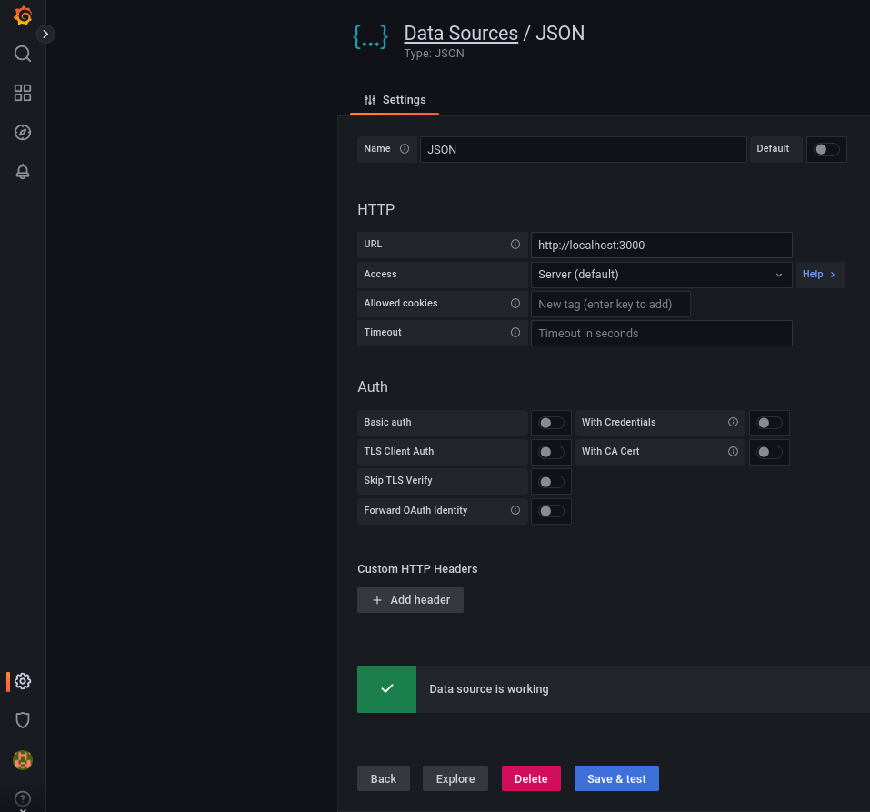
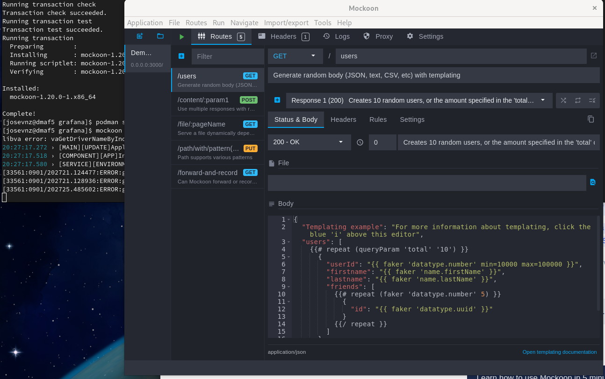

# Customizing Grafana Dashboards using variables with simpod-json-datasource, Mockoon, FastApi and Prometheus

You probably know that Grafana has excellent integration with Prometheus exporter; In fact, it comes with several pre-built dashboards that can collect all types of metrics that can be displayed.

Now imaging that you also have your hosts organized in logical groups and for sake of argument you have a nice Ansible inventory file where you keep your hosts organized:


````yaml
---
# Inventory host for a fictional network for the Nunez Barrios family
---
all:
  children:
    linux:
      hosts:
        macmini2:
        raspberrypi:
        dmaf5:
        mac-pro-1-1:
      vars:
        description: Linux servers for the Nunez Barrios family
    windows:
      hosts:
        windows01:
      vars:
        description: Windows Desktops/ laptops for the Nunez Barrios family
    osx:
      hosts:
        veronicalaptop
      vars:
        description: OSX Desktops/ laptops for the Nunez Barrios family
    pi:
      hosts:
        raspberrypi
      vars:
        description: Raspberry PI 4 servers for Nunez Barrios family

````

And our Ansible playbooks will get access to this inventory like this:

```shell
[josevnz@dmaf5 ~]$ ansible-inventory --inventory ~/grafana/Dashboards/hosts.yaml --list
{
    "_meta": {
        "hostvars": {
            "dmaf5": {
                "description": "Linux servers for the Nunez Barrios family"
            },
            "mac-pro-1-1": {
                "description": "Linux servers for the Nunez Barrios family"
            },
            "macmini2": {
                "description": "Linux servers for the Nunez Barrios family"
            },
            "raspberrypi": {
                "description": "Raspberry PI 4 servers for Nunez Barrios family"
            },
            "veronicalaptop": {
                "description": "OSX Desktops/ laptops for the Nunez Barrios family"
            },
            "windows01": {
                "description": "Windows Desktops/ laptops for the Nunez Barrios family"
            }
        }
    },
    "all": {
        "children": [
            "linux",
            "osx",
            "pi",
            "ungrouped",
            "windows"
        ]
    },
    "linux": {
        "hosts": [
            "dmaf5",
            "mac-pro-1-1",
            "macmini2",
            "raspberrypi"
        ]
    },
    "osx": {
        "hosts": [
            "veronicalaptop"
        ]
    },
    "pi": {
        "hosts": [
            "raspberrypi"
        ]
    },
    "windows": {
        "hosts": [
            "windows01"
        ]
    }
}
```

Normally [Ansible inventory files](https://www.redhat.com/sysadmin/ansible-dynamic-inventories) are well maintained and kept on a source control repository like Git, or they are generated dynamically; In this tutorial I'll show you how to filter hosts by group in your Grafana dashboard using variables, and we will see how to populate those variables from our Ansible host inventory file (taking advantage of the groups).


## Adding the simpod-json-datasource

In order to get data from custom JSON datasource, you may use the [simpod-json-datasource](https://grafana.com/grafana/plugins/simpod-json-datasource/) plugin.

On your Grafana installation, do the following:

```shell
podman exec --interactive --tty grafana /bin/bash
I have no name!@ae23d7e1123e:/usr/share/grafana$ grafana-cli plugins install simpod-json-datasource
✔ Downloaded simpod-json-datasource v0.4.2 zip successfully

Please restart Grafana after installing plugins. Refer to Grafana documentation for instructions if necessary.
exit
podman restart grafana
```

Now Grafana is ready to pull data in JSON format, which we will use to customize the dashboard.

## Working in reverse: Defining how our REST-API will look like using a Mock.

Before start coding, we should get an idea how our API should look like, so it can be consumed by the simpod-json-datasource plugin; First, after [reading the documentation](https://github.com/simPod/GrafanaJsonDatasource)
we know the following 3 endpoints must exist:

1. GET / with 200 status code response. Used for "Test connection" on the datasource config page.
2. POST /search to return available metrics.
3. POST /query to return panel data or annotations.

And for completeness, we will also implement the following:

4. POST /variable to return data for Variable of type Query.
5. POST /tag-keys returning tag keys for ad hoc filters.
6. POST /tag-values returning tag values for ad hoc filters.

But it gets better, as the project also made an [OpenAPI definition](https://github.com/simPod/GrafanaJsonDatasource/blob/0.3.x/openapi.yaml) we can use.

So before we got and start writing any code to serve our Ansible inventory file contents, let's see put together some fake data with our Grafana datasource.

### Using Mockoon CLI

The [Mockoon cli](https://mockoon.com/cli/) promises to make this very easy for us, specially if it can import an OpenAPI file; this will make it very easy to see how the structure of each of the JSON endpoints look like.

For our demonstration, we will use a podman container (which is also a very convenient way to run mockoon):

```shell
[josevnz@dmaf5 ~]$ podman pull mockoon/cli
✔ docker.io/mockoon/cli:latest
Trying to pull docker.io/mockoon/cli:latest...
Getting image source signatures
Copying blob c7f07ae1b0b3 done  
Copying blob a4ccd857fdac done  
Copying blob 3c44c88e45b5 done  
Copying blob 2d397e1a1b68 done  
Copying blob d17b05e78f36 done  
Copying blob 530afca65e2e done  
Copying config 77fb1c05b9 done  
Writing manifest to image destination
Storing signatures
77fb1c05b9b7748ac6201853a0ac9f1109a043832c2a9b8e462d2c6fb3a2074c
```

And grab a copy of the OpenAPI for the JSON datasource:
```shell
[josevnz@dmaf5 Dashboards]$ curl --remote-name --location --fail https://raw.githubusercontent.com/simPod/GrafanaJsonDatasource/0.3.x/openapi.yaml
  % Total    % Received % Xferd  Average Speed   Time    Time     Time  Current
                                 Dload  Upload   Total   Spent    Left  Speed
100  8208  100  8208    0     0  59912      0 --:--:-- --:--:-- --:--:-- 59912
```

And then we serve it using Mockoon:
```shell
[josevnz@dmaf5 Dashboards]$ podman run --name fake_json --detach --mount type=bind,source=$PWD/openapi.yaml,target=/data,readonly --publish 3000:3000 mockoon/cli:latest --data data --port 3000
5213f01c80e0efe6f6df571fcd69d9f15aeb3fbec7b933a54ce2597d5d331ee8
[josevnz@dmaf5 Dashboards]$ podman logs fake_json
{"level":"info","message":"Server started on port 3000","mockName":"mockoon-simpod-json-datasource-api","timestamp":"2022-09-01T23:04:12.234Z"}
```

So what kind of data we can get back for each one of the endpoints? Let's exercise it with curl getting the required endpoints:

[](https://asciinema.org/a/518450)

Note than _the mock is returning static responses as expected_, so the payload passed to the POST method (--data) it is meaningless.


Next step is to add our new datasource in Grafana:




Now that we know how the data should look like, we can create fake responses that look more like our Ansible inventory file contents.

For now stop the mockoon/cli container:
```shell
podman stop fake_json
```

## Faking it until it works, using Mockoon GUI

Let's install and run the mockoon GUI:
```shell

[josevnz@dmaf5 grafana]$ sudo dnf install -y https://github.com/mockoon/mockoon/releases/download/v1.20.0/mockoon-1.20.0.rpm
...
Installed:
  mockoon-1.20.0-1.x86_64                                                                                                                                                                                                                                

Complete!
mockoon
```
It will look like something like this:



After experimenting with the GUI and following the excellent documentation (specially the templating part) I ended creating a Mockoon REST mock. 
