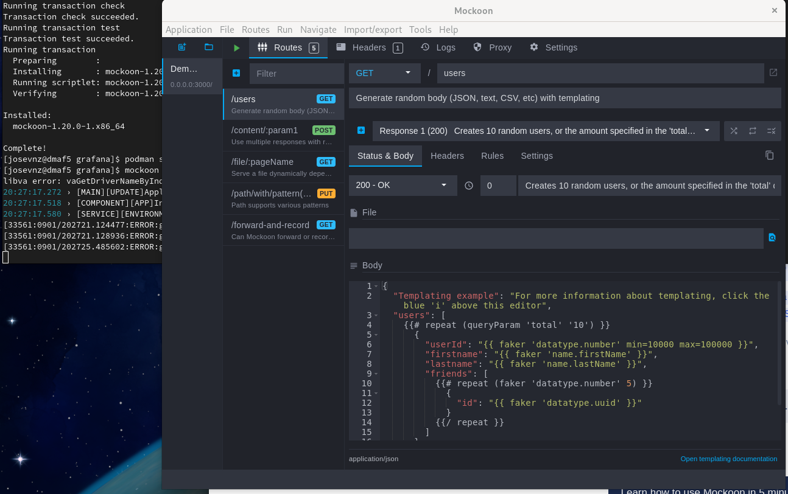
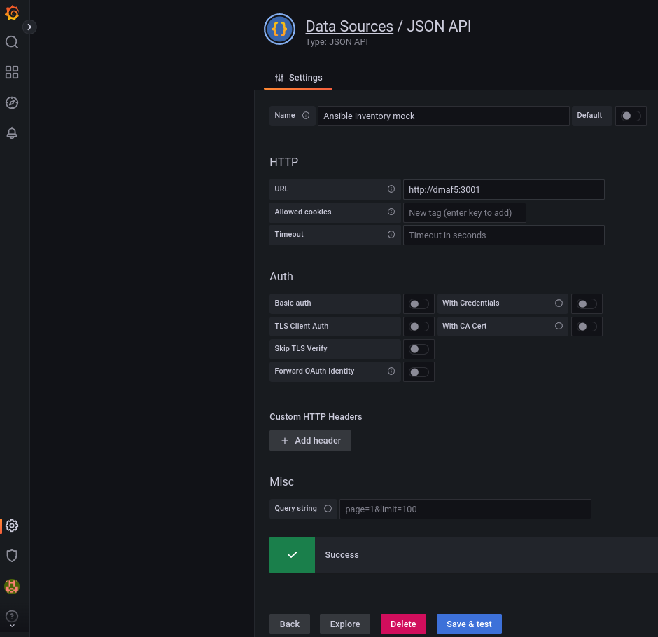
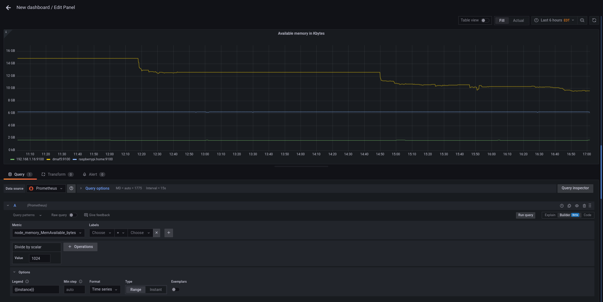
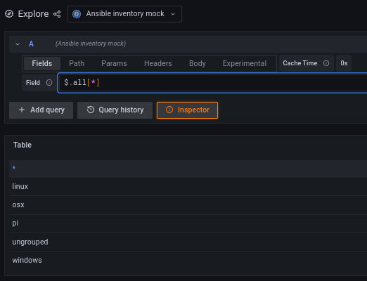
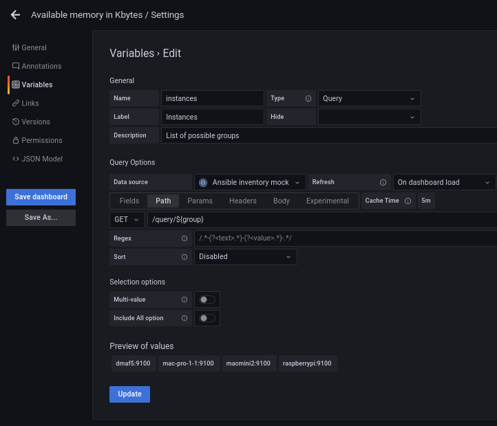
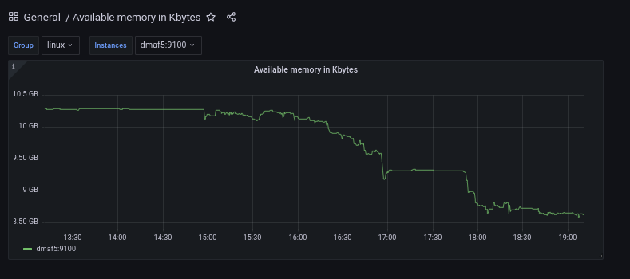

# Customizing Grafana Dashboards using variables with custom JSON DataSource, Mockoon, FastApi and Prometheus

You probably know that Grafana has excellent integration with Prometheus exporter; In fact, it comes with several pre-built dashboards that can collect all types of metrics that can be displayed.

Now imaging that you also have your hosts organized in logical groups and for sake of argument you have a nice Ansible inventory file where you keep your hosts organized:

````yaml
---
# Inventory host for a fictional network for the Nunez Barrios family
---
all:
  children:
    linux:
      hosts:
        macmini2:
        raspberrypi:
        dmaf5:
        mac-pro-1-1:
      vars:
        description: Linux servers for the Nunez Barrios family
    windows:
      hosts:
        windows01:
      vars:
        description: Windows Desktops/ laptops for the Nunez Barrios family
    osx:
      hosts:
        veronicalaptop
      vars:
        description: OSX Desktops/ laptops for the Nunez Barrios family
    pi:
      hosts:
        raspberrypi
      vars:
        description: Raspberry PI 4 servers for Nunez Barrios family

````

And our Ansible playbooks will get access to this inventory like this:

```shell
[josevnz@dmaf5 ~]$ ansible-inventory --inventory ~/grafana/Dashboards/hosts.yaml --list
{
    "_meta": {
        "hostvars": {
            "dmaf5": {
                "description": "Linux servers for the Nunez Barrios family"
            },
            "mac-pro-1-1": {
                "description": "Linux servers for the Nunez Barrios family"
            },
            "macmini2": {
                "description": "Linux servers for the Nunez Barrios family"
            },
            "raspberrypi": {
                "description": "Raspberry PI 4 servers for Nunez Barrios family"
            },
            "veronicalaptop": {
                "description": "OSX Desktops/ laptops for the Nunez Barrios family"
            },
            "windows01": {
                "description": "Windows Desktops/ laptops for the Nunez Barrios family"
            }
        }
    },
    "all": {
        "children": [
            "linux",
            "osx",
            "pi",
            "ungrouped",
            "windows"
        ]
    },
    "linux": {
        "hosts": [
            "dmaf5",
            "mac-pro-1-1",
            "macmini2",
            "raspberrypi"
        ]
    },
    "osx": {
        "hosts": [
            "veronicalaptop"
        ]
    },
    "pi": {
        "hosts": [
            "raspberrypi"
        ]
    },
    "windows": {
        "hosts": [
            "windows01"
        ]
    }
}
```

Normally [Ansible inventory files](https://www.redhat.com/sysadmin/ansible-dynamic-inventories) are well maintained and kept on a source control repository like Git, or they are generated dynamically; In this tutorial I'll show you how to filter hosts by group in your Grafana dashboard using variables, and we will see how to populate those variables from our Ansible host inventory file (taking advantage of the groups).

By the time you are done reading this tutorial you will have learned about the following:

* Install plugins in Grafana, running inside a Podman container
* Create mock REST api endpoints to simulate a webservice, for quick prototyping using Mockoon
* Connect the mock REST API with Grafana to populate missing values on a Panel that uses Prometheus data for monitoring
* And finally writing a simple webservice to provide to static host inventory file through a REST endpoint to Grafana. 

**What you will need for this tutorial**:
* A basic knowledge of [Ansible inventories](https://www.redhat.com/sysadmin/ansible-dynamic-inventories) (not require but never hurts)
* A Fedora or RPM based distribution, with elevated privileges (like [SUDO](https://www.sudo.ws/))
* Working [Podman](https://docs.podman.io/en/latest/index.html) [installation](https://www.redhat.com/sysadmin/automate-podman-ansible)
* Working Grafana. Installation [is described in detail](https://grafana.com/docs/grafana/latest/setup-grafana/installation/) on the vendor website.
* One or more nodes running [the prometheus node exporter](https://prometheus.io/docs/guides/node-exporter/). I will show you how to connect a [prometheus data source](https://grafana.com/docs/grafana/latest/datasources/prometheus/), but in reality you can do this integration with any other [Grafana datasource](https://grafana.com/docs/grafana/latest/datasources/).
* An editor like [Vim](https://www.vim.org/), VSCode or Pycharm to make changes to the templates included in the [source code for this tutorial](https://github.com/josevnz/grafana).
* Curiosity! 

Let's dive in then on how to connect our Ansible inventory file with Grafana.

## Choosing a JSON datasource: Pick your poison

There are several choices for the JSON datasource, I will mention 3 of them and why I choose one:

### [grafana simple json](https://grafana.com/grafana/plugins/grafana-simple-json-datasource/)
It is the official plugin ... [and it is deprecated](https://github.com/grafana/simple-json-datasource) (last update at least 16 months ago on github). Stay away from it.

### [simpod-json-datasource](https://grafana.com/grafana/plugins/simpod-json-datasource/) 

Plugin is very complete and easy to use, documentation is also well writen and is actively maintained.

But I decided against it for the following reasons:
* It will force you to generate the JSON with a well-defined structure that is understood by the plugin; this is not an issue for our demonstration, as we will craft the resulting JSON from scratch but if you have an existing web service exporting a JSON this is less than convenient.
* The endpoint that shows the data ('/query') requires you to use the POST method (so you can pass search arguments). Not a big deal, but you feel more at home using GET with query arguments you are out of luck.

### [JSON API](https://grafana.com/grafana/plugins/marcusolsson-json-datasource)

It is my favorite because:
* You can use an existing REST endpoint and get the fields you want using JSONPath expressions; You can define alias to the retrieved values
* Well documented and maintained
* Installation is very easy.

On your Grafana installation, do the following to get JSON API installed:

```shell
podman exec --interactive --tty grafana /bin/bash
I have no name!@ae23d7e1123e:grafana-cli plugins install marcusolsson-json-datasource
✔ Downloaded marcusolsson-json-datasource v1.3.1 zip successfully
Please restart Grafana after installing plugins. Refer to Grafana documentation for instructions if necessary.
exit
podman restart grafana
```

Now Grafana is ready to pull data in JSON format, which we will use to customize the dashboard.

## Working in reverse: Defining how our REST-API will look like using a Mock.

Before start coding, we should get an idea how our API should look like, so it can be consumed by the JSON API plugin; The following must be true:

1. GET / with 200 status code response. Used for "Test connection" on the datasource config page.
2. GET /search. We will use this to filter servers by group
3. GET /query/{ansiblegroup}/ to return the list of all the available groups we can use when searching by group

So before we got and start writing any code to serve our Ansible inventory file contents, let's see put together some fake data with our Grafana datasource.

## Faking it until it works, using Mockoon GUI

The definition of a mock is:
> To mimic or resemble closely.

And that is exactly what we will do, we will create a fake REST webservice with a JSON good enough we can connect to Grafana to simulate our web service; Once we are satisfied with the results we will then invest time writing our real REST endpoint.

Let's install and run the Mockoon GUI:
```shell

[josevnz@dmaf5 grafana]$ sudo dnf install -y https://github.com/mockoon/mockoon/releases/download/v1.20.0/mockoon-1.20.0.rpm
...
Installed:
  mockoon-1.20.0-1.x86_64                                                                                                                                                                                                                                
Complete!
mockoon
```
It will look like something like this:



After experimenting with the GUI and following the documentation, I ended creating a REST mock:


Unsurprisingly looks a lot like our Ansible inventory file converted to JSON format, and that is the whole point for our exercise.

Here is how it looks when you run queries against it using curl:

[](https://asciinema.org/a/519126)

Next step is to construct our Dashboard with data coming from Prometheus; First create a new datasource using JSON API:



And next create a [Dashboard](https://grafana.com/docs/grafana/latest/dashboards/); For our example we will monitor available RAM in K bytes over time:



Now is time to add a variable that will hold the groups and the hosts; Also if you noticed we will have to 'enrich' the name of the machine
a little to match the label used by the prometheus node (hint: A tool like [jsonpath.com](http://jsonpath.com/) will help you to make sure your JSONPath expression is correct, I found the inline editor to be 'picky' sometimes).

We need 2 [query variables](https://grafana.com/docs/grafana/latest/variables/variable-types/add-query-variable/), let's see the expressions first:

1. Get the list of all the groups: ```jsonpath $.all.children[*]```, it will return something like ```json ["linux", "osx", "pi", "ungrouped", "windows" ]```. Say we save a single result, like the first group, on a variable called 'group'
2. Then using that group (assume we are using 'linux') we can query next the list of hosts; For example to get all the linux machines: ```json $.linux.hosts[*]``` will give you something like ```json [ "dmaf5", "mac-pro-1-1", "macmini2", "raspberrypi"]```
3. But we need to make the group generic. Again, we use the Grafana variables and the JSONPath becomes: ```json $.linux.${group}[*]```
4. This will give us the list of hosts by group.

If you notice, Prometheus returns either a job (node-exporter) or an instance (raspberrypi:9100) for a given host; We can enrich our host list to make it look like a Prometheus instance by passing an extra argument to our query (enrich=true) so returned host looks like this: ```raspberrypi:9100``` instead of ```raspberrypi```.

### Not so fast: I'm not getting any data for my variable!

We try to get the list of all the available groups in our inventory from a JSON fragment like this:

```json
{    
  "all": {
        "children": [
            "linux",
            "osx",
            "pi",
            "ungrouped",
            "windows"
        ]
    }
}
```


But then, to our dismay we find out than the variable creation doesn't work due some weird bug involving parsing the nested "children" tag.

The JSON path I tried actually renders the array like results I'm looking for, so what is going on here (I'm using the Python jsonpath module to illustrate)?

```shell
(inventory) [josevnz@dmaf5 Dashboards]$ python
Python 3.9.9 (main, Nov 19 2021, 00:00:00) 
[GCC 10.3.1 20210422 (Red Hat 10.3.1-1)] on linux
Type "help", "copyright", "credits" or "license" for more information.
>>> from jsonpath import JSONPath
>>> import json
>>> data=json.loads('''{    
...   "all": {
...         "children": [
...             "linux",
...             "osx",
...             "pi",
...             "ungrouped",
...             "windows"
...         ]
...     }
... }''')
>>> query="$.all.children[*]"
>>> JSONPath(query).parse(data)
['linux', 'osx', 'pi', 'ungrouped', 'windows']
```

I suspect it is a bug on the plugin; To prove it, I will change the structure returned with Mockoon to remove the un-necessary "children" tag

```json
{    
  "all": [
            "linux",
            "osx",
            "pi",
            "ungrouped",
            "windows"
        ]
}
```

Then if we try again from Grafana we can see than the structure is now parsed properly



Now you can see the power of working with a Mock REST API for rapid prototyping.

Once we have the group we can write a more intuitive REST endpoint that uses the group we selected on the previous step; For example if we call ```/query/linux``` we could get:

```json
[ "dmaf5:9100", "mac-pro-1-1:9100", "macmini2:9100", "raspberrypi:9100" ]
```

Our second variable path looks like this (Using the variable $group in the path expression ```/query${group}```):



And the fields get as simple as ```$.[*]```


At the end this is how the 2 variables will look like:


Now that we know what we want, we can focus on writing a web service with the required REST endpoints.

Before we do that, I want to show you real quick the other JSON plugin with Grafana and another Mockoon tool you may use. 

### Quick detour: What if you wanted to use simPod JSON instead?

The simPod JSON plugin comes with an OpenAPI definition you can use to get an idea what kind of JSON you will get back if you implement a REST service that follows this model; Let me show you quickly how Mockoon can work with that out of the box: 

And grab a copy of the OpenAPI for the JSON datasource:
```shell
[josevnz@dmaf5 Dashboards]$ curl --remote-name --location --fail https://raw.githubusercontent.com/simPod/GrafanaJsonDatasource/0.3.x/openapi.yaml
  % Total    % Received % Xferd  Average Speed   Time    Time     Time  Current
                                 Dload  Upload   Total   Spent    Left  Speed
100  8208  100  8208    0     0  59912      0 --:--:-- --:--:-- --:--:-- 59912
```

And then we serve it using [Mockoon cli](https://mockoon.com/cli/) with a podman container:

```shell
[josevnz@dmaf5 ~]$ podman pull mockoon/cli
✔ docker.io/mockoon/cli:latest
Trying to pull docker.io/mockoon/cli:latest...
Getting image source signatures
Copying blob c7f07ae1b0b3 done  
Copying blob a4ccd857fdac done  
Copying blob 3c44c88e45b5 done  
Copying blob 2d397e1a1b68 done  
Copying blob d17b05e78f36 done  
Copying blob 530afca65e2e done  
Copying config 77fb1c05b9 done  
Writing manifest to image destination
Storing signatures
77fb1c05b9b7748ac6201853a0ac9f1109a043832c2a9b8e462d2c6fb3a2074c
```

And run it:

```shell
[josevnz@dmaf5 Dashboards]$ podman run --name fake_json --detach --mount type=bind,source=$PWD/openapi.yaml,target=/data,readonly --publish 3000:3000 mockoon/cli:latest --data data --port 3000
5213f01c80e0efe6f6df571fcd69d9f15aeb3fbec7b933a54ce2597d5d331ee8
[josevnz@dmaf5 Dashboards]$ podman logs fake_json
{"level":"info","message":"Server started on port 3000","mockName":"mockoon-simpod-json-datasource-api","timestamp":"2022-09-01T23:04:12.234Z"}
```

So what kind of data we can get back for each one of the endpoints? Let's exercise it with [curl](https://curl.se/) getting the required endpoints:

[](https://asciinema.org/a/518450)

Note than _the mock is returning static responses as expected_, so the payload passed to the POST method (--data) it is meaningless.

Next step is to add our new mock datasource in Grafana:


Now that we know how the data should look like, we can create fake responses that look more like our Ansible inventory file contents.

For now stop the mockoon/cli container, as we will not use it anymore and will focus on the real Webservice instead:
```shell
podman stop fake_json
```

## Getting real: Writing a REST webservice using FastAPI and Python.

If you clone the project then you can set it up to run the webservice like this (I pass the --reload-include '*.yaml' to restart the application if the inventory file changes too, not just the application):

```shell
sudo dnf install -y python3-pyyaml
python3 -m venv --system-site-packages ~/virtualenv/inventory
. ~/virtualenv/inventory/bin/activate
pip install --upgrade pip
pip install --upgrade build
pip install --upgrade wheel
pip install --editable .
uvicorn --host 0.0.0.0 --reload --reload-include '*.yaml' inventory.main:app
```

Then on a different terminal we can quickly test the REST API:

[](https://asciinema.org/a/520316)

The only change we need to make now is to create a new datasource pointing to our webservice (not the one running Mockoon) and see it in action:



# What is next?

* The ability of Grafana to mix multiple datasource's to create a comprehensive view of your system is a power tool; Each [datasource](https://grafana.com/docs/grafana/latest/datasources/) offers multiple parameters to filter and transform the data, and you saw how you can combine 2 by using [variables](https://grafana.com/docs/grafana/latest/dashboards/variables/add-template-variables/)
* FastAPI is a great tool to [create REST API](https://fastapi.tiangolo.com/tutorial/) endpoints; We didn't cover [automated testing](https://fastapi.tiangolo.com/tutorial/testing/) and this is something you should read about.
* Mockoon offers several fancy features like '[partial proxy](https://mockoon.com/docs/latest/proxy-mode/)' (when you don't want to mock a whole service), [serve files](https://mockoon.com/docs/latest/file-serving/) as a response, etc. Worth to take a look.
* You saw how easy is to start services with PODMAN; What if you want to coordinate the startup, like first the Ansible Webservice we just wrote and then Grafana? You can use [docker compose](https://www.redhat.com/sysadmin/podman-docker-compose) for that.
* I used python jsonpath but did not explain its features in detail; [it is worth to add](https://pypi.org/project/jsonpath-python/) to the list of tools in your arsenal.
